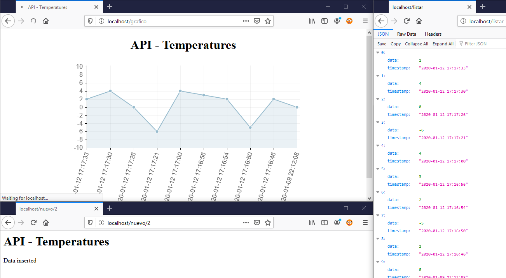

[](https://hub.docker.com/_/python) [](https://coveralls.io/github/shotgunsoftware/python-api?branch=master) [](https://twitter.com/adrisalas_)  

# Python API with SQLite

Simple project to serve as a basis for creating APIs in Python using Flask and SQLite

## Installation

##### Option 1: Default
```bash
git clone https://github.com/adrisalas/python-sqlite-api.git
cd ./api/
pip install Flask
pip install sqlite
pip install requests
python app.py
```
##### Option 2: In a Docker container
```bash
git clone https://github.com/adrisalas/python-sqlite-api.git
docker build -t pythonapi
docker run -p 4000:80 python-api-sqlite
```

## Usage

Introducing new data
```http
http://localhost/nuevo/2
http://localhost/nuevo/-5
http://localhost/nuevo/2
http://localhost/nuevo/4
```
Show real-time graph _[Chart.js](https://www.chartjs.org/)_
```http
http://localhost/grafico
```
Full list the API _JSON Format_
```http
http://localhost/listar
```
Query 10 last data _JSON Format_
```http
http://localhost/listajson
```
Flush data *Slow mode*
```http
http://localhost/flush
```
Shutdown
```http
http://localhost/nuevo/404
```


## Screenshots



